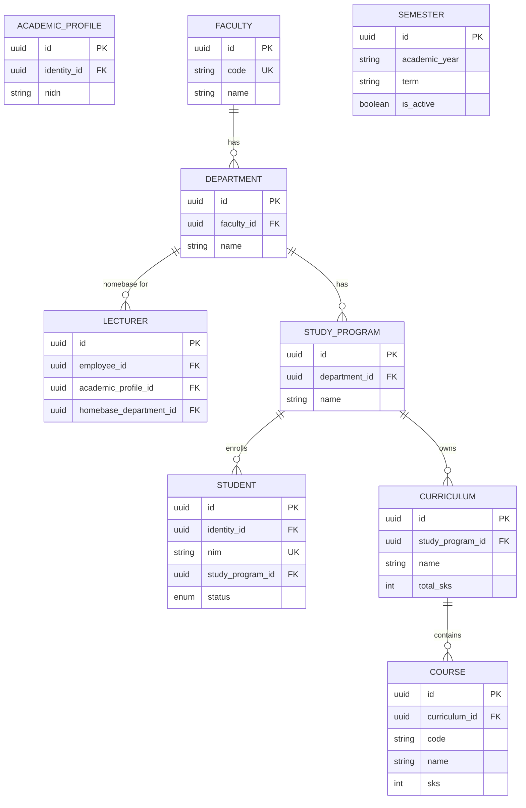

# Enterprise ERD (Phase 2.5 Baseline)

```mermaid
erDiagram
    %% Core Domain
    STUDENT {
        uuid id PK
        uuid identity_id FK
        string nim UK
        uuid study_program_id FK
        enum status
    }
    
    LECTURER {
        uuid id PK
        uuid employee_id FK
        uuid academic_profile_id FK
        uuid homebase_department_id FK
    }

    ACADEMIC_PROFILE {
        uuid id PK
        uuid identity_id FK
        string nidn
    }
    
    FACULTY {
        uuid id PK
        string code UK
        string name
    }
    
    DEPARTMENT {
        uuid id PK
        uuid faculty_id FK
        string name
    }
    
    STUDY_PROGRAM {
        uuid id PK
        uuid department_id FK
        string name
    }

    %% Academic Domain
    CURRICULUM {
        uuid id PK
        uuid study_program_id FK
        string name
        int total_sks
    }
    
    COURSE {
        uuid id PK
        uuid curriculum_id FK
        string code
        string name
        int sks
    }

    SEMESTER {
        uuid id PK
        string academic_year
        string term
        boolean is_active
    }

    %% Relationships
    FACULTY ||--o{ DEPARTMENT : "has"
    DEPARTMENT ||--o{ STUDY_PROGRAM : "has"
    STUDY_PROGRAM ||--o{ STUDENT : "enrolls"
    STUDY_PROGRAM ||--o{ CURRICULUM : "owns"
    CURRICULUM ||--o{ COURSE : "contains"
    DEPARTMENT ||--o{ LECTURER : "homebase for"
```
