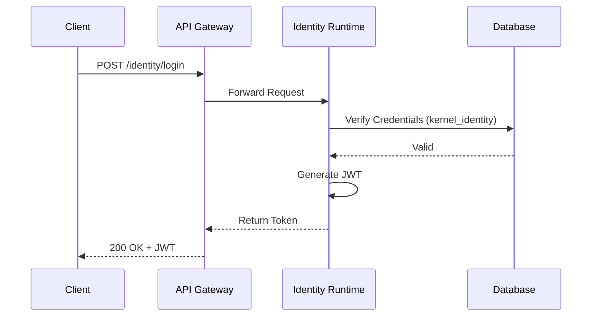
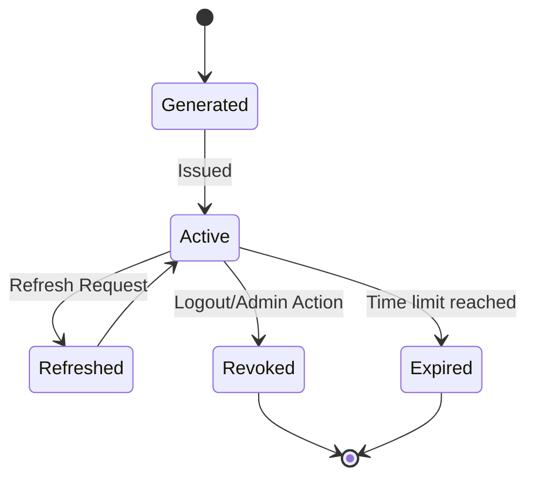
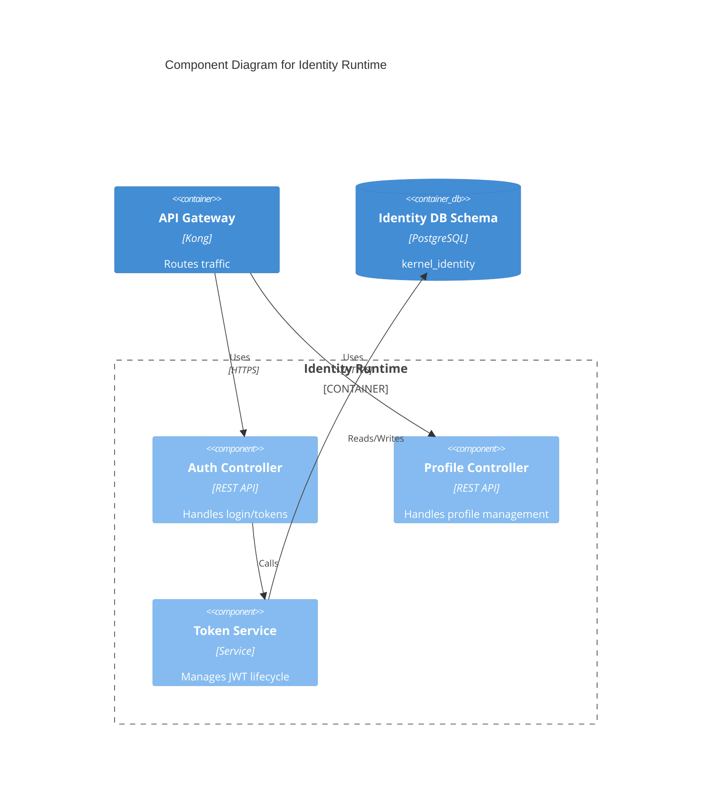
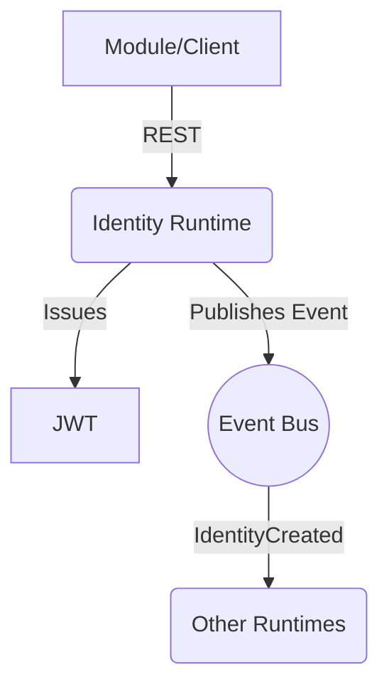

# Identity Runtime Contract

## Purpose
Provides a standardized and secure contract for authentication, identity management, and token lifecycles across the Campus OS ecosystem.

## Responsibilities
- Authentication of all actors (users, systems, devices).
- Issuance, validation, and revocation of access tokens.
- Profile and session management.

## Public API

### Commands
- `POST /identity/login` - Authenticate and establish a session.
- `POST /identity/token` - Refresh or issue tokens.
- `PUT /identity/profile` - Update user profile information.

### Queries
- `GET /identity/profile` - Retrieve the current authenticated user's profile.

## Published Events
- `IdentityCreated`
- `IdentityUpdated`
- `IdentityVerified`
- `IdentityDisabled`

## Consumed Events
- None.

## Error Codes
- `ID-401`: Authentication failed.
- `ID-403`: Access forbidden.
- `ID-404`: Identity not found.

## Security
- All endpoints must use HTTPS.
- Passwords must be hashed using Argon2.

## Authorization
- Requires standard `Bearer` token for all endpoints except `login` and `token`.

## Database Mapping
Schema: `kernel_identity`

## Dependencies
- Knowledge Runtime (for policy rules)

## Observability
- Metrics on login failure rate.
- Token generation latency.

## Performance Targets
- Login latency < 100ms
- Token validation < 50ms

## Versioning
- API Version: `v1`
- Backwards compatible with Phase 2 definitions.

## Compatibility
- OpenAPI 3.1 compliant.

## Examples
*See `04_RUNTIME_CONTRACTS/examples/identity` for JSON examples.*

## Diagram

### Authentication Flow (Sequence Diagram)

### Token Lifecycle (State Machine)

### C4 Component Diagram

### Runtime Interaction Diagram

## Certification Checklist
- [x] Metadata Complete
- [x] API Documented
- [x] Events Documented
- [x] Database Mapped
- [x] Diagrams Rendered
- [x] Traceability Validated
