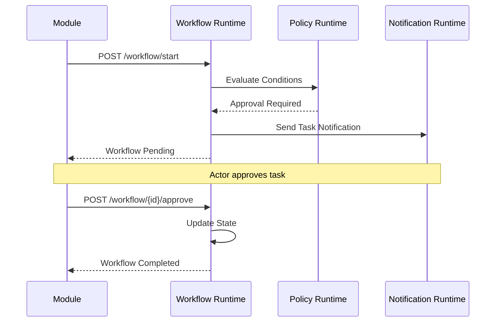
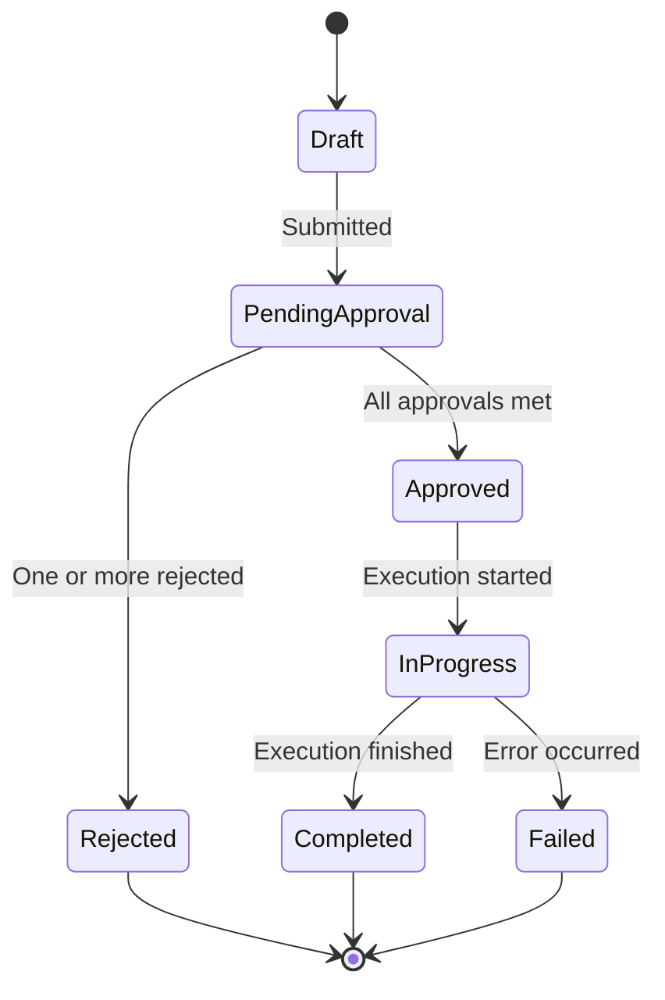
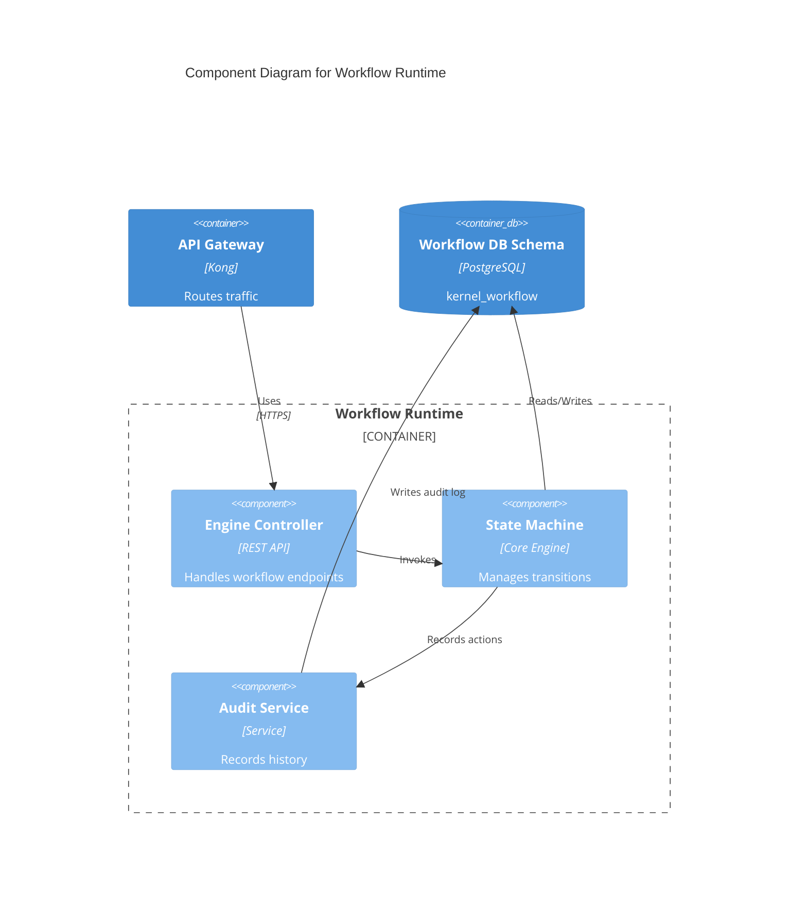
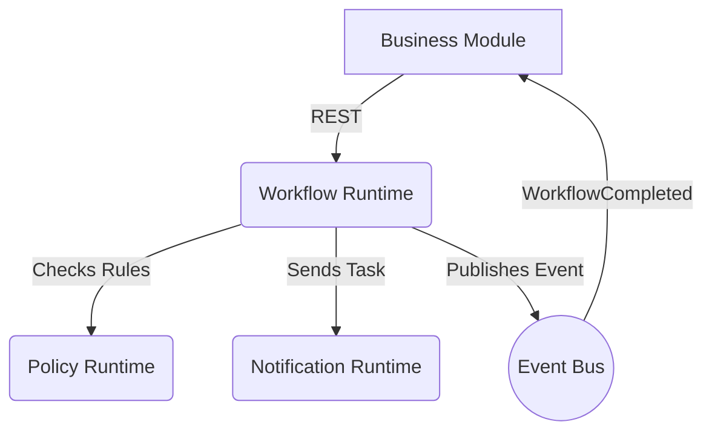

# Workflow Runtime Contract

## Purpose
Provides a standardized engine and contract for orchestrating business processes, approvals, and state transitions across Campus OS modules.

## Responsibilities
- Managing state transitions for business entities.
- Orchestrating approval flows and multi-step processes.
- Maintaining audit trails of workflow executions.

## Public API

### Commands
- `POST /workflow/start` - Initiate a new workflow instance.
- `POST /workflow/{id}/approve` - Approve a workflow task.
- `POST /workflow/{id}/reject` - Reject a workflow task.

### Queries
- `GET /workflow/{id}` - Retrieve the current state of a workflow instance.

## Published Events
- `WorkflowStarted`
- `WorkflowApproved`
- `WorkflowRejected`
- `WorkflowCompleted`

## Consumed Events
- Module-specific events that trigger workflow progression.

## Error Codes
- `WF-400`: Invalid workflow state transition.
- `WF-403`: Unauthorized to approve/reject.
- `WF-404`: Workflow instance not found.

## Security
- Requires mutual TLS for inter-service communication.

## Authorization
- Validated via Identity and Policy runtimes to ensure actor can transition state.

## Database Mapping
Schema: `kernel_workflow`

## Dependencies
- Identity Runtime (Actor resolution)
- Policy Runtime (Approval conditions)
- Notification Runtime (Task assignments)

## Observability
- Workflow completion times.
- Bottleneck detection in approval queues.

## Performance Targets
- State transition < 200ms
- Workflow startup < 500ms

## Versioning
- API Version: `v1`

## Compatibility
- OpenAPI 3.1 compliant.

## Examples
*See `04_RUNTIME_CONTRACTS/examples/workflow` for JSON examples.*

## Diagram

### Approval Flow (Sequence Diagram)

### Workflow Lifecycle (State Machine)

### C4 Component Diagram

### Runtime Interaction Diagram

## Certification Checklist
- [x] Metadata Complete
- [x] API Documented
- [x] Events Documented
- [x] Database Mapped
- [x] Diagrams Rendered
- [x] Traceability Validated
