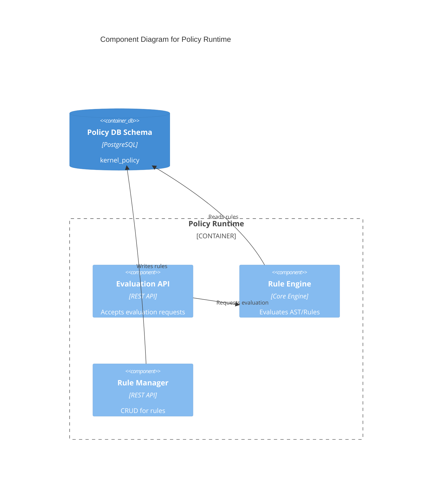
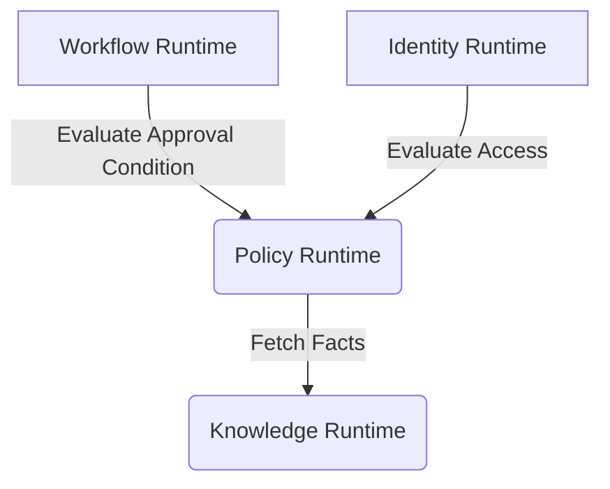

# Policy Runtime Contract

## Purpose
Provides a centralized engine for evaluating business rules, permissions, and conditions across Campus OS.

## Responsibilities
- Evaluating access control (RBAC/ABAC).
- Validating business conditions (e.g., "Student must have GPA > 3.0").
- Maintaining rule definitions.

## Public API

### Commands
- `POST /policy/evaluate` - Evaluate a set of rules against a given context.
- `POST /policy/rules` - Add or update a policy rule.

### Queries
- `GET /policy/rules/{id}` - Retrieve a specific policy rule.

## Published Events
- `PolicyUpdated`

## Consumed Events
- None.

## Error Codes
- `POL-400`: Invalid context or rule syntax.
- `POL-403`: Unauthorized to manage rules.
- `POL-404`: Rule not found.

## Security
- Rule definitions are versioned and immutable once activated.

## Authorization
- Only Admin actors can modify rules.

## Database Mapping
Schema: `kernel_policy`

## Dependencies
- Knowledge Runtime (To fetch ontology for complex rules)

## Observability
- Evaluation latency.
- Rule execution count.

## Performance Targets
- Evaluation < 20ms

## Versioning
- API Version: `v1`

## Compatibility
- OpenAPI 3.1 compliant.

## Examples
*See `04_RUNTIME_CONTRACTS/examples/policy` for JSON examples.*

## Diagram

### C4 Component Diagram

### Runtime Interaction Diagram

## Certification Checklist
- [x] Metadata Complete
- [x] API Documented
- [x] Events Documented
- [x] Database Mapped
- [x] Diagrams Rendered
- [x] Traceability Validated
