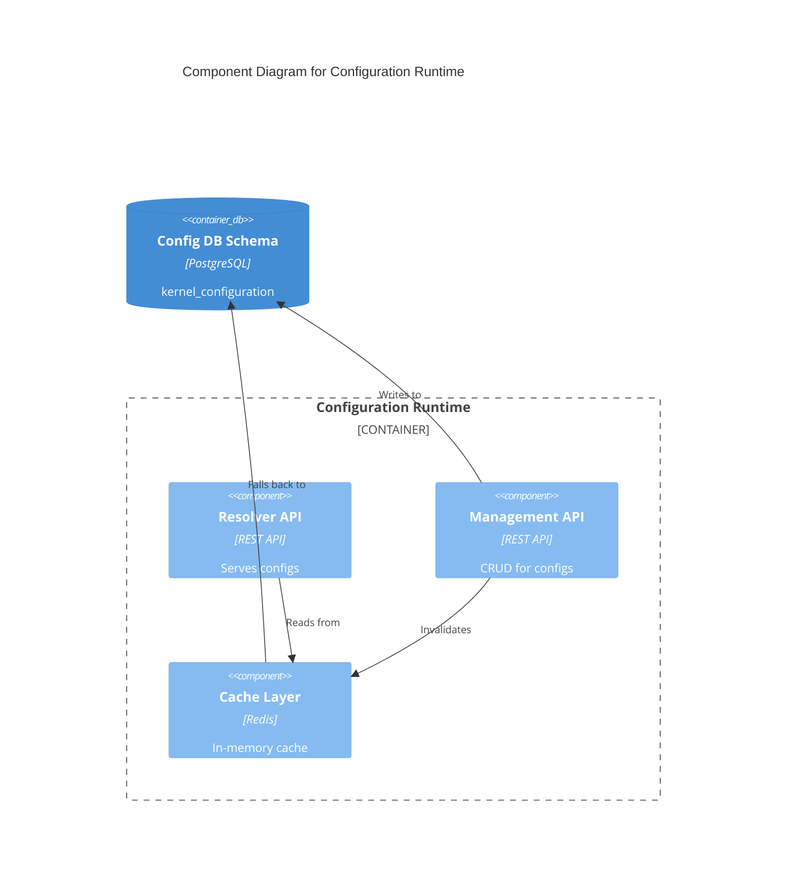
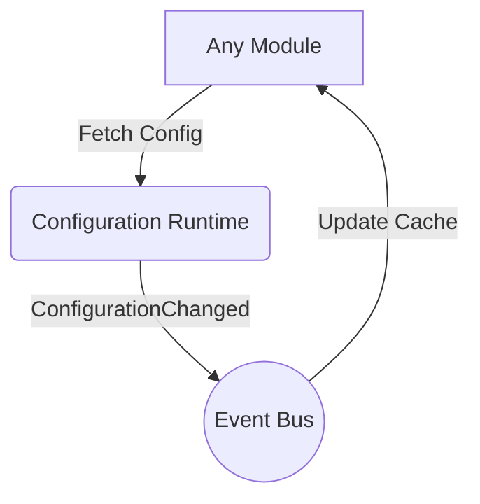

# Configuration Runtime Contract

## Purpose
Manages global, tenant-specific, and module-specific configuration settings and feature flags across Campus OS.

## Responsibilities
- Storing and serving dynamic configuration variables.
- Managing feature toggles.
- Resolving hierarchical configuration (Global > Tenant > Module).

## Public API

### Commands
- `POST /configuration/keys` - Create or update a configuration key.
- `POST /configuration/flags/{flag}/toggle` - Toggle a feature flag.

### Queries
- `GET /configuration/resolve` - Resolve configuration for a given context.

## Published Events
- `ConfigurationChanged`
- `FeatureFlagToggled`

## Consumed Events
- None.

## Error Codes
- `CFG-400`: Invalid configuration payload.
- `CFG-404`: Key or Flag not found.

## Security
- Secrets must be encrypted at rest and in transit.

## Authorization
- Only Admin actors can modify configurations.
- Read access is restricted to authenticated internal services.

## Database Mapping
Schema: `kernel_configuration`

## Dependencies
- None.

## Observability
- Cache hit ratio.
- Frequency of configuration updates.

## Performance Targets
- Resolution < 10ms (cached)

## Versioning
- API Version: `v1`

## Compatibility
- OpenAPI 3.1 compliant.

## Examples
*See `04_RUNTIME_CONTRACTS/examples/configuration` for JSON examples.*

## Diagram

### C4 Component Diagram

### Runtime Interaction Diagram

## Certification Checklist
- [x] Metadata Complete
- [x] API Documented
- [x] Events Documented
- [x] Database Mapped
- [x] Diagrams Rendered
- [x] Traceability Validated
