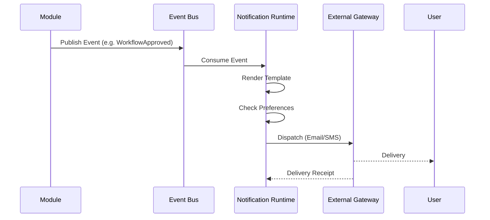
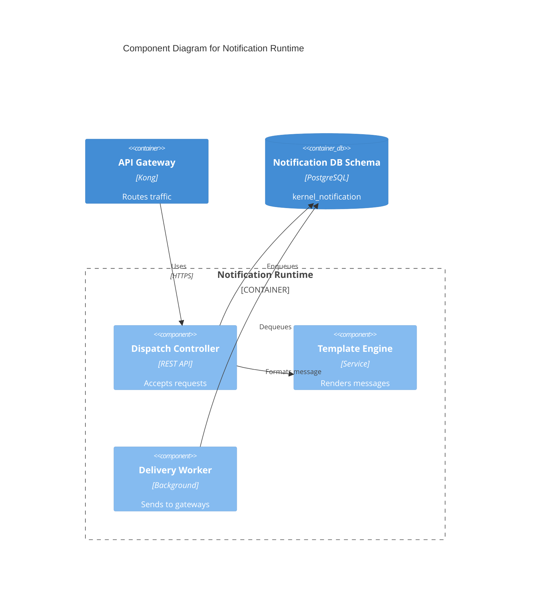
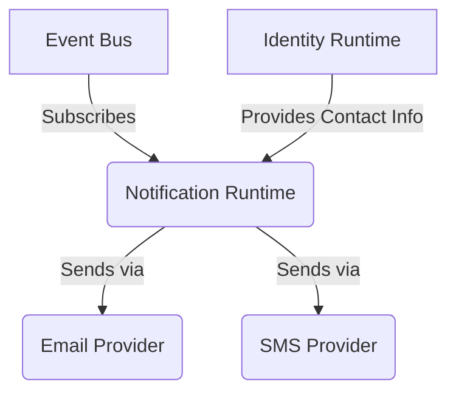

# Notification Runtime Contract

## Purpose
Provides a centralized and robust mechanism to deliver messages (email, SMS, push, in-app) to actors across the Campus OS platform.

## Responsibilities
- Routing notifications to appropriate channels based on user preferences.
- Managing templates and localization for messages.
- Retrying failed deliveries and tracking notification status.

## Public API

### Commands
- `POST /notification/send` - Enqueue a notification for delivery.
- `POST /notification/preferences` - Update user notification preferences.

### Queries
- `GET /notification/history` - Retrieve a user's notification history.

## Published Events
- `NotificationSent`
- `NotificationFailed`
- `NotificationRead`

## Consumed Events
- Any system event mapped to a notification rule (e.g., `WorkflowStarted` -> Send Email).

## Error Codes
- `NOT-400`: Invalid notification payload or missing template.
- `NOT-404`: User preference not found.
- `NOT-500`: Delivery gateway error.

## Security
- API keys required for external delivery providers (SendGrid, Twilio).

## Authorization
- Internal service authentication for sending notifications.
- Bearer token for users viewing their own history.

## Database Mapping
Schema: `kernel_notification`

## Dependencies
- Identity Runtime (User contact info)
- Configuration Runtime (Templates)

## Observability
- Delivery success rate by channel.
- Delivery latency.

## Performance Targets
- Enqueue time < 50ms
- Delivery (Internal) < 5s

## Versioning
- API Version: `v1`

## Compatibility
- OpenAPI 3.1 compliant.

## Examples
*See `04_RUNTIME_CONTRACTS/examples/notification` for JSON examples.*

## Diagram

### Publish-Subscribe Flow (Sequence Diagram)

### C4 Component Diagram

### Runtime Interaction Diagram

## Certification Checklist
- [x] Metadata Complete
- [x] API Documented
- [x] Events Documented
- [x] Database Mapped
- [x] Diagrams Rendered
- [x] Traceability Validated
