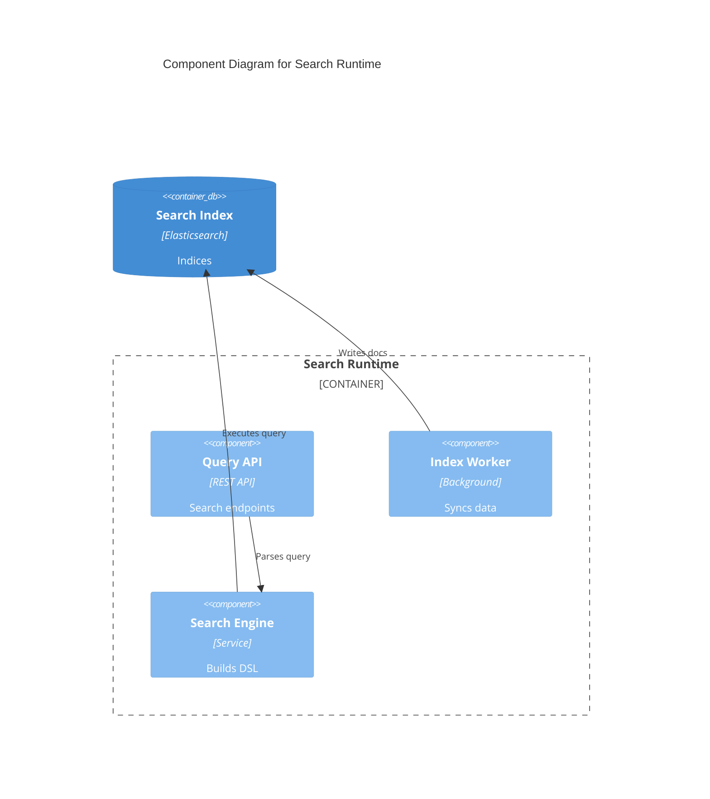
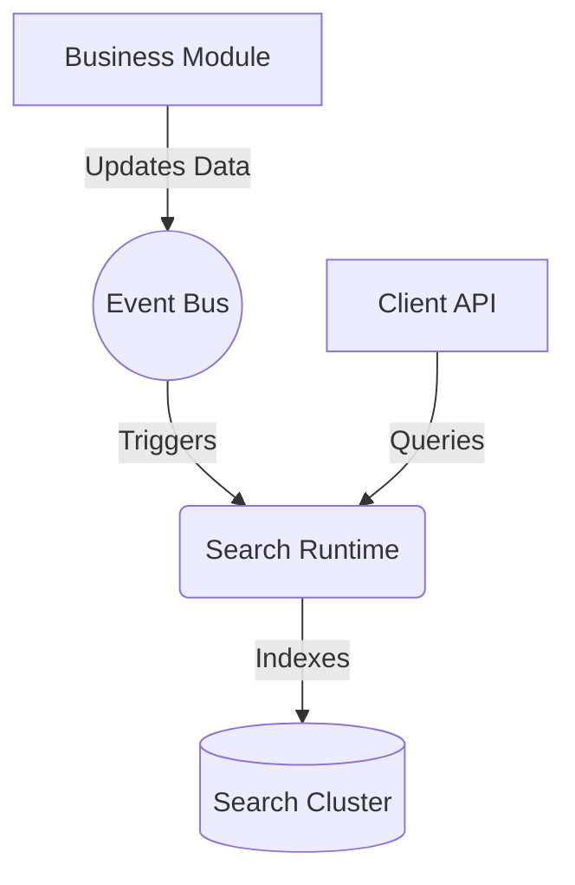

# Search Runtime Contract

## Purpose
Provides full-text search, filtering, and faceted search capabilities across structured and unstructured data in Campus OS.

## Responsibilities
- Indexing entities and documents.
- Processing search queries with aggregations.
- Managing search aliases and index lifecycle.

## Public API

### Commands
- `POST /search/index/{alias}` - Index a document.
- `DELETE /search/index/{alias}/{id}` - Remove a document from index.

### Queries
- `POST /search/query` - Perform a search query against indices.

## Published Events
- `DocumentIndexed`

## Consumed Events
- Module data changes (to trigger re-indexing).

## Error Codes
- `SCH-400`: Invalid query syntax.
- `SCH-404`: Index not found.

## Security
- Result filtering based on the caller's authorization context (Row-Level Security mapping).

## Authorization
- End-users can only search data they are permitted to view.

## Database Mapping
Schema: `kernel_search` (Configuration only, actual index in OpenSearch/Elasticsearch)

## Dependencies
- Identity Runtime (For authorization context)

## Observability
- Search latency.
- Index operation throughput.

## Performance Targets
- Search < 50ms

## Versioning
- API Version: `v1`

## Compatibility
- OpenAPI 3.1 compliant.

## Examples
*See `04_RUNTIME_CONTRACTS/examples/search` for JSON examples.*

## Diagram

### C4 Component Diagram

### Runtime Interaction Diagram

## Certification Checklist
- [x] Metadata Complete
- [x] API Documented
- [x] Events Documented
- [x] Database Mapped
- [x] Diagrams Rendered
- [x] Traceability Validated
