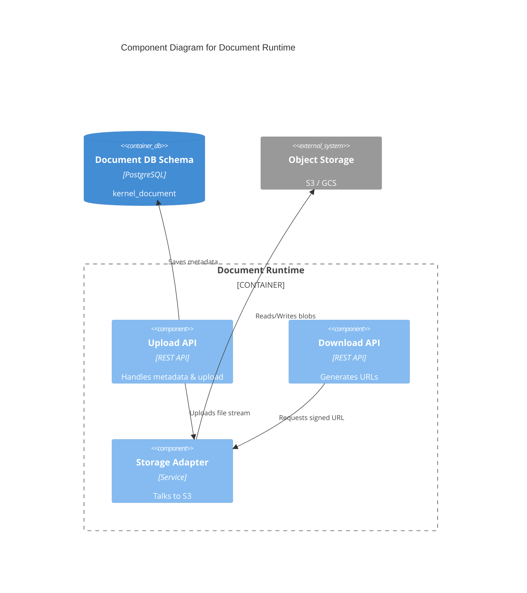
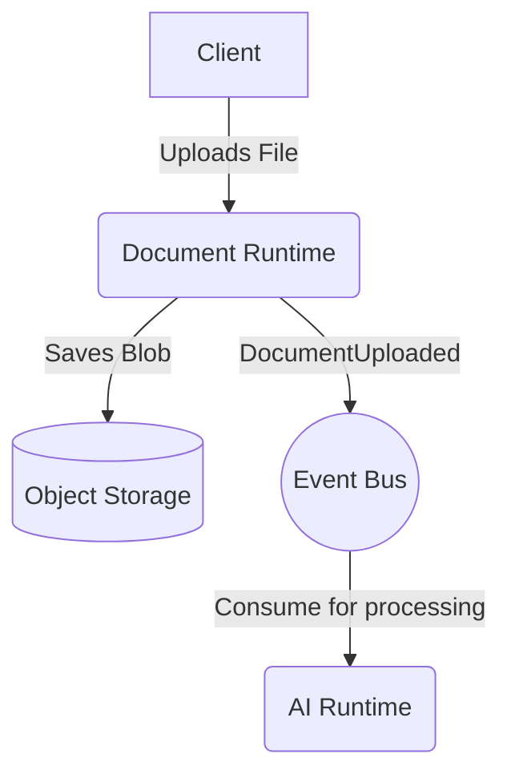

# Document Runtime Contract

## Purpose
Manages the lifecycle, storage, versioning, and retrieval of physical files and digital documents across Campus OS.

## Responsibilities
- Handling file uploads, downloads, and multipart transfers.
- Storing files securely in object storage (e.g., S3, GCS).
- Generating pre-signed URLs for direct access.

## Public API

### Commands
- `POST /document/upload` - Upload a new document.
- `DELETE /document/{id}` - Delete a document.

### Queries
- `GET /document/{id}/download` - Generate a secure download URL.

## Published Events
- `DocumentUploaded`
- `DocumentDeleted`

## Consumed Events
- None.

## Error Codes
- `DOC-400`: Invalid file format or size limit exceeded.
- `DOC-404`: Document not found.

## Security
- Files are scanned for malware upon upload.
- Pre-signed URLs have strict expiration times.

## Authorization
- Only document owners or authorized personnel can download.

## Database Mapping
Schema: `kernel_document` (Metadata only)

## Dependencies
- Storage Runtime (Abstracts underlying object storage)

## Observability
- Storage usage over time.
- Upload/Download bandwidth.

## Performance Targets
- URL Generation < 20ms

## Versioning
- API Version: `v1`

## Compatibility
- OpenAPI 3.1 compliant.

## Examples
*See `04_RUNTIME_CONTRACTS/examples/document` for JSON examples.*

## Diagram

### C4 Component Diagram

### Runtime Interaction Diagram

## Certification Checklist
- [x] Metadata Complete
- [x] API Documented
- [x] Events Documented
- [x] Database Mapped
- [x] Diagrams Rendered
- [x] Traceability Validated
