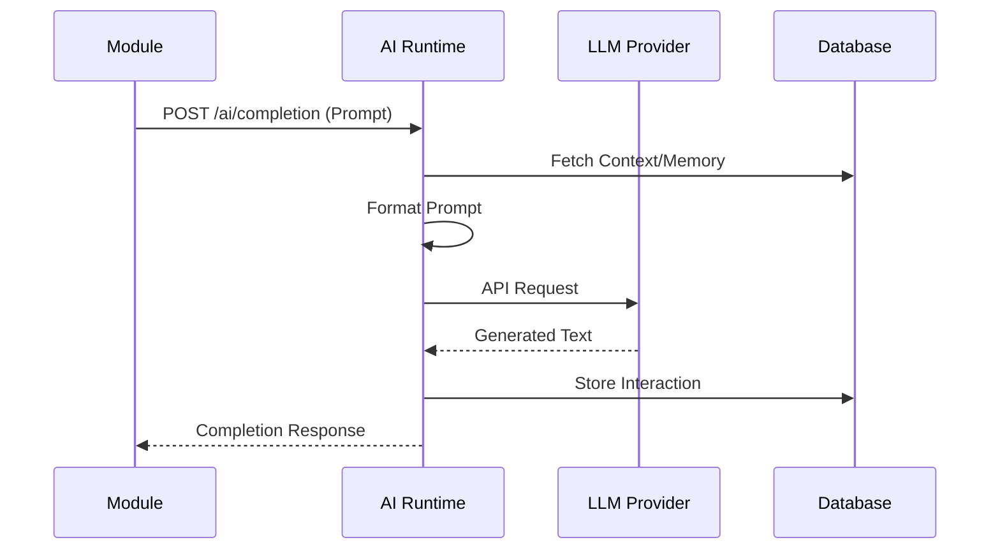
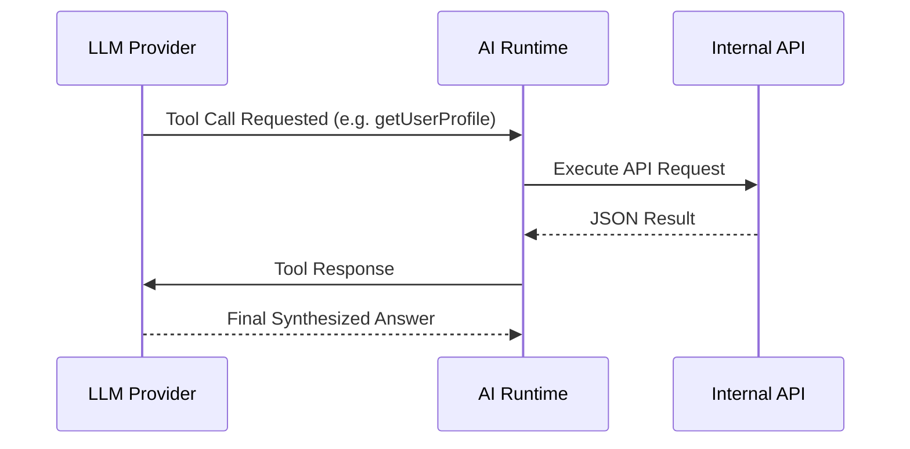
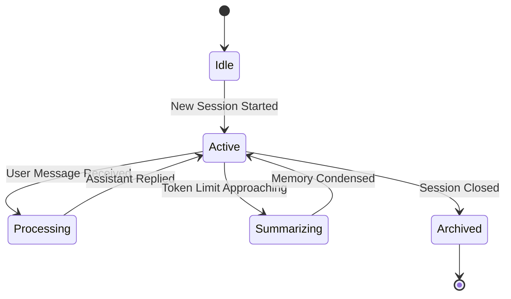
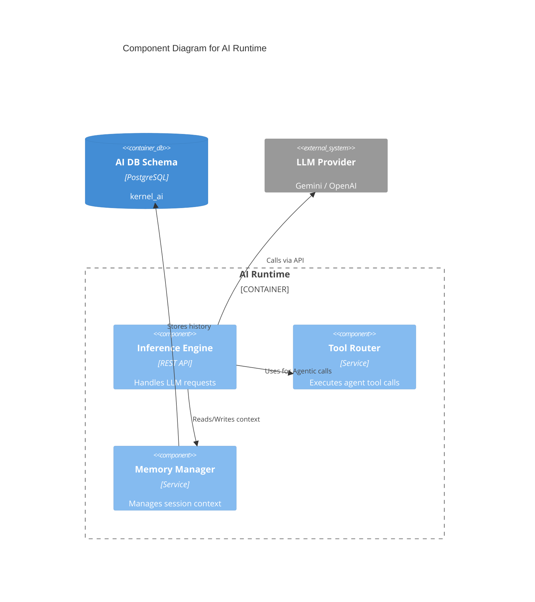

# AI Runtime Contract

## Purpose
Provides an abstraction layer for integrating Large Language Models (LLMs) and agentic capabilities within Campus OS, isolating modules from specific vendor implementations.

## Responsibilities
- Managing prompt execution and LLM inference.
- Handling tool invocation routing for agentic workflows.
- Managing short-term and long-term memory for conversational contexts.

## Public API

### Commands
- `POST /ai/chat` - Send a message to an AI agent.
- `POST /ai/completion` - Request a text completion for a prompt.

### Queries
- `GET /ai/memory/{sessionId}` - Retrieve the memory context of a specific session.

## Published Events
- `AiInferenceCompleted`
- `AiToolInvoked`

## Consumed Events
- System events mapped to proactive AI agents.

## Error Codes
- `AI-429`: Rate limit exceeded.
- `AI-500`: Vendor API failure.
- `AI-503`: Model temporarily unavailable.

## Security
- API Keys stored in Configuration Runtime securely.
- User queries are scrubbed of PII before transmission.

## Authorization
- Internal service authentication for module access.

## Database Mapping
Schema: `kernel_ai`

## Dependencies
- Knowledge Runtime (RAG capability)
- Configuration Runtime (Model settings)

## Observability
- Token usage metrics.
- Inference latency per model.

## Performance Targets
- TTFT (Time To First Token) < 1s
- Tool Invocation Roundtrip < 2s

## Versioning
- API Version: `v1`

## Compatibility
- OpenAPI 3.1 compliant.

## Examples
*See `04_RUNTIME_CONTRACTS/examples/ai` for JSON examples.*

## Diagram

### Prompt Flow (Sequence Diagram)

### Tool Invocation Flow (Sequence Diagram)

### Memory Flow (State Machine)

### C4 Component Diagram

## Certification Checklist
- [x] Metadata Complete
- [x] API Documented
- [x] Events Documented
- [x] Database Mapped
- [x] Diagrams Rendered
- [x] Traceability Validated
