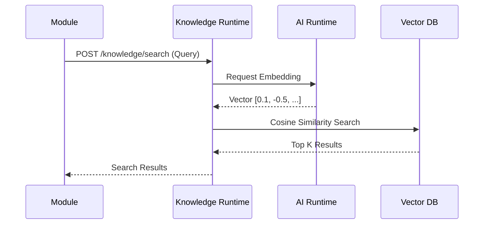
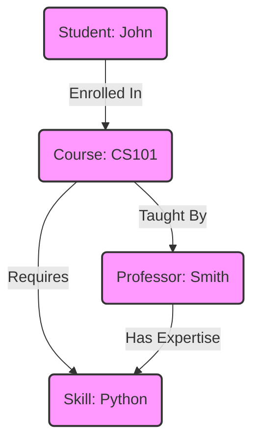
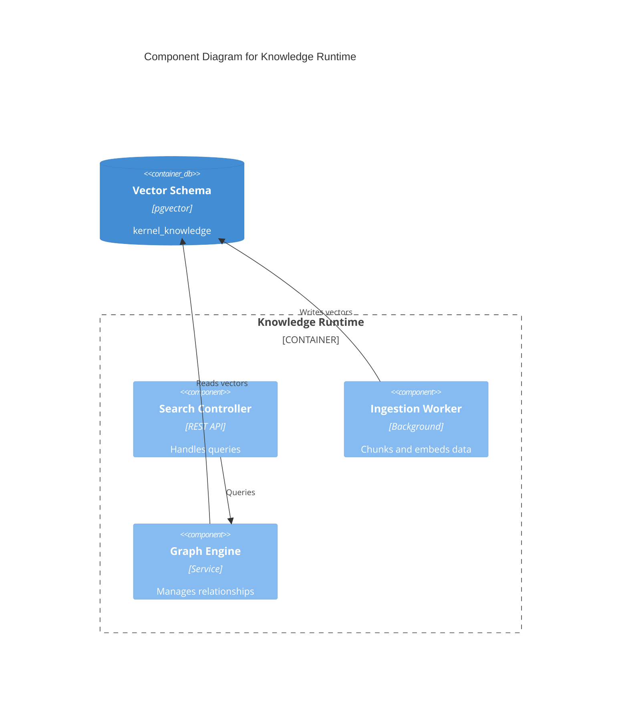

# Knowledge Runtime Contract

## Purpose
Provides a semantic search and knowledge graph foundation for retrieving relevant context, policies, and master data across Campus OS.

## Responsibilities
- Ingesting, chunking, and embedding unstructured and structured data.
- Maintaining the enterprise Knowledge Graph (Ontology).
- Executing semantic searches and hybrid queries.

## Public API

### Commands
- `POST /knowledge/ingest` - Ingest a new document or data point into the knowledge base.
- `POST /knowledge/search` - Perform a semantic search query.

### Queries
- `GET /knowledge/entity/{id}` - Retrieve graph nodes connected to a specific entity.

## Published Events
- `KnowledgeIngested`
- `KnowledgeUpdated`

## Consumed Events
- Module data updates (e.g., `DocumentPublished`, `CourseCreated`) to keep vector indices fresh.

## Error Codes
- `KNW-400`: Invalid query format.
- `KNW-404`: Entity not found in graph.
- `KNW-500`: Vector database connection error.

## Security
- Data partitioning by tenant and visibility rules.

## Authorization
- Scoped access based on user role to ensure they only retrieve knowledge they are permitted to see.

## Database Mapping
Schema: `kernel_knowledge`

## Dependencies
- AI Runtime (For embedding generation)
- Document Runtime (For source files)

## Observability
- Search latency.
- Index size and growth rate.

## Performance Targets
- Semantic Search < 300ms
- Ingestion Processing < 5s

## Versioning
- API Version: `v1`

## Compatibility
- OpenAPI 3.1 compliant.

## Examples
*See `04_RUNTIME_CONTRACTS/examples/knowledge` for JSON examples.*

## Diagram

### Semantic Search Flow (Sequence Diagram)

### Knowledge Graph (C4 / Graph Interaction)

### C4 Component Diagram

## Certification Checklist
- [x] Metadata Complete
- [x] API Documented
- [x] Events Documented
- [x] Database Mapped
- [x] Diagrams Rendered
- [x] Traceability Validated
