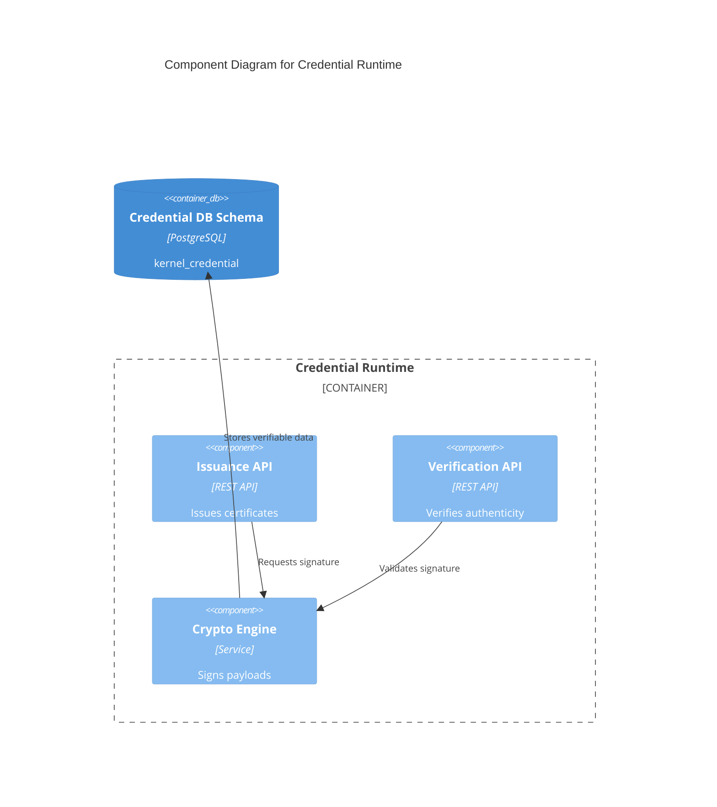
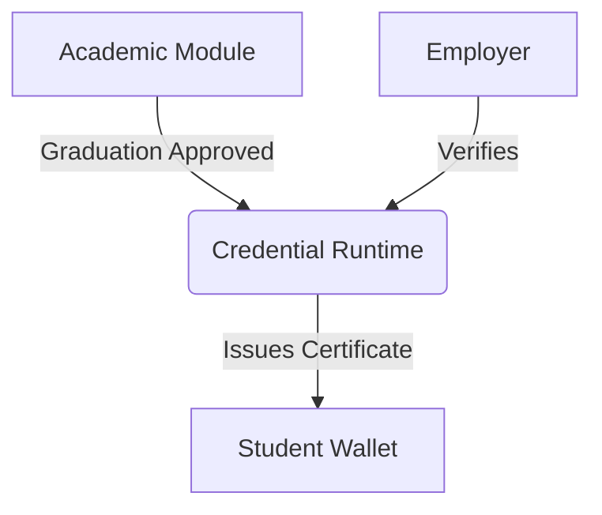

# Credential Runtime Contract

## Purpose
Manages verifiable credentials, digital certificates, and academic transcripts in a secure, tamper-proof manner.

## Responsibilities
- Issuing and verifying digital academic credentials.
- Managing revocation lists and credential states.
- Providing standardized JSON-LD or similar verifiable formats.

## Public API

### Commands
- `POST /credential/issue` - Issue a new credential.
- `POST /credential/{id}/revoke` - Revoke an existing credential.

### Queries
- `GET /credential/{id}/verify` - Verify the authenticity of a credential.

## Published Events
- `CredentialIssued`
- `CredentialRevoked`

## Consumed Events
- `WorkflowApproved` (Triggering credential issuance upon graduation approval).

## Error Codes
- `CRD-400`: Invalid credential schema.
- `CRD-404`: Credential not found.
- `CRD-410`: Credential revoked.

## Security
- Credentials are cryptographically signed.
- Verification endpoint is public, issuance requires high-level authorization.

## Authorization
- Policy rules define who can issue which types of credentials.

## Database Mapping
Schema: `kernel_credential`

## Dependencies
- Identity Runtime (Subject of the credential)

## Observability
- Issuance volume over time.
- Verification request volume.

## Performance Targets
- Verification < 50ms
- Issuance < 2s

## Versioning
- API Version: `v1`

## Compatibility
- OpenAPI 3.1 compliant.

## Examples
*See `04_RUNTIME_CONTRACTS/examples/credential` for JSON examples.*

## Diagram

### C4 Component Diagram

### Runtime Interaction Diagram

## Certification Checklist
- [x] Metadata Complete
- [x] API Documented
- [x] Events Documented
- [x] Database Mapped
- [x] Diagrams Rendered
- [x] Traceability Validated
