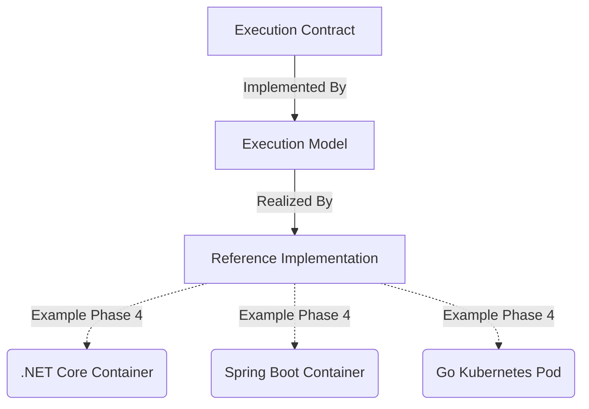

# Kernel Execution Architecture

## Purpose
The Kernel Execution Architecture defines the abstract execution model of Campus OS. It provides the foundation for how the system initializes, runs, discovers services, injects dependencies, routes events, and maintains operational health.

## Core Principle
**"Architecture specifies capabilities; Engineering selects technologies."**

The specifications outlined in the `05_KERNEL_EXECUTION` namespace are completely agnostic to specific programming languages, frameworks, or deployment platforms (e.g., .NET, Spring Boot, Kubernetes, Kafka). They define the *Execution Contract*.

## Execution Model

The Campus Kernel operates as a modular runtime host. Its execution model is composed of the following core pillars:

1. **Bootstrap Sequence**: The deterministic startup routine that prepares the environment for module loading.
2. **Runtime Lifecycle**: The strict state machine governing a runtime's existence from creation to disposal.
3. **Dependency Injection**: The abstract inversion-of-control container managing object lifetimes and resolutions.
4. **Service Discovery**: The mechanism for runtimes to locate and communicate with each other dynamically.
5. **Event Bus**: The message broker abstraction handling pub/sub, broadcasts, and reliable delivery.
6. **Scheduler**: The subsystem for deferred and recurring task execution.
7. **Health & Observability**: The standardized endpoints and telemetry pipelines ensuring system transparency.

## Abstraction Layers

## Related Documents
- `EA-0061`: Runtime Lifecycle
- `EA-0062`: Service Discovery
- `EA-0063`: Dependency Injection
- `EA-0064`: Event Bus
- `EA-0065`: Scheduler
- `EA-0066`: Observability
- `EA-0067`: Health Management
- `EA-0068`: Configuration Lifecycle
- `EA-0069`: Kernel Bootstrap
- `EA-0070`: Runtime State Machine
- `EA-0071`: Execution Security
