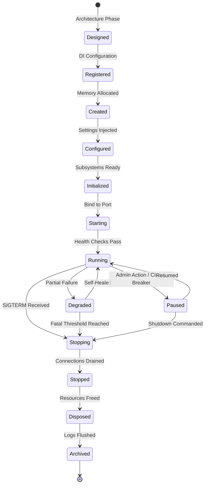

# Runtime State Machine

## Purpose
Provides the formal visual representation of the Runtime Lifecycle defined in `EA-0061`. This state machine dictates the allowed transitions for any Runtime Instance executing within Campus OS.

## State Diagram

## Transition Rules
- **Forward Progress Only (Startup)**: An instance cannot transition from `Configured` back to `Created`. If setup fails, it must transition directly to `Stopping` -> `Stopped`.
- **Halt on Failure**: Any failure during the `Initialized` or `Starting` phase MUST prevent transition to `Running`.
- **Graceful Degradation**: Transitioning to `Degraded` indicates a failure that does not prevent core functionality (e.g., failure to connect to a secondary cache). Liveness checks still pass.
