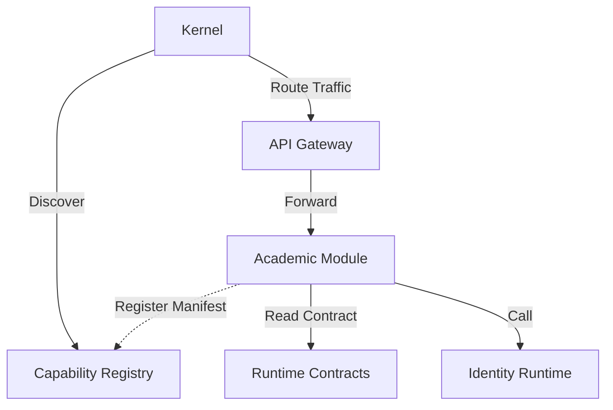

# Plugin Architecture

## Purpose
Defines the mechanics of how Business Modules attach to the Campus OS Kernel without requiring modifications to the Kernel's source code or recompilation.

## The Plugin Model

Campus OS adopts an Out-of-Process Plugin Architecture (or Network-level Plugin). Modules are NOT dynamically linked libraries (DLLs/JARs) loaded into the Kernel's memory space. Instead, they are distinct Runtime Instances that "plug in" logically via network contracts.

## Plugin Registration
When a Module starts, it registers itself to the Kernel via the Capability Registry (`EA-0092`), passing its Module Manifest (`EA-0089`). The Kernel parses this manifest to dynamically configure the API Gateway to route traffic to the module.

## Benefits
- **Language Agnosticism**: Because plugins run out-of-process, the Kernel can be written in Go while the Academic Module is written in Java, and the AI module in Python.
- **Fault Isolation**: A crash in a Business Module does not crash the Kernel.
- **Independent Scaling**: Modules can be scaled horizontally completely independent of the Kernel.

## Abstraction Boundary
The Kernel does not know the implementation details of any Module. It only knows what is declared in the Module Manifest and interacts solely via OpenAPI and Event schemas.
