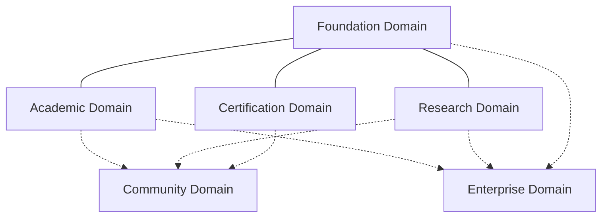

# Business Domain Map

## Purpose
Visualizes the macro-level relationships between the official Business Domains of Campus OS, ensuring that strategic boundaries remain clear as the platform scales.

## Domain Relationships

Campus OS organizes its business capabilities into six highly cohesive domains. 

### 1. Foundation Domain
The bedrock. It does not contain educational logic. It provides the identities, organizational structures, and communications required by all other domains.

### 2. Academic Domain
The core business of a university. It relies heavily on Foundation for identities and organizations, and feeds data into Enterprise (Tuition) and Certification (Degrees).

### 3. Research Domain
The knowledge creation engine. Operates semi-autonomously from Academic, but shares Foundation identities and relies on Enterprise for Grant Management.

### 4. Certification Domain
The credentialing engine. It consumes outcomes from Academic (Degrees) and external inputs (Professional CPDs) to issue verifiable credentials.

### 5. Community Domain
The external outreach engine (Alumni, Corporate Partners). It bridges the internal academic world with the external ecosystem.

### 6. Enterprise Domain
The back-office operations (Finance, HR). It supports the entire institution. It is agnostic to whether a payment is for a student's tuition or a research grant.
