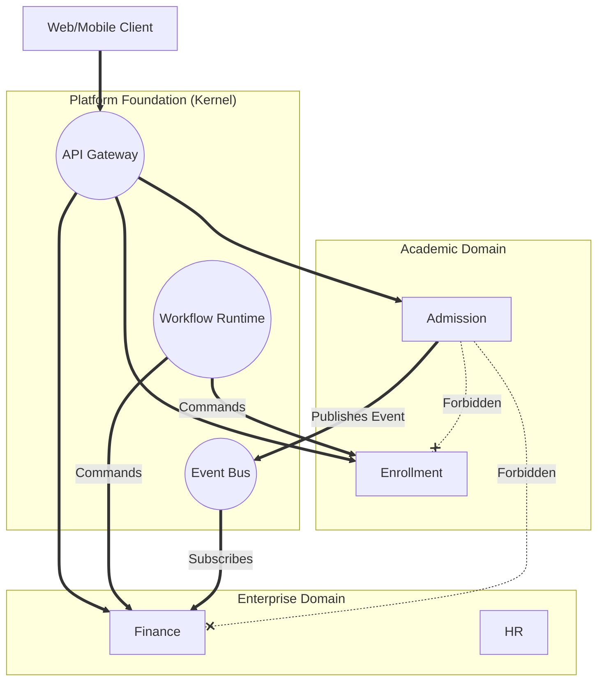

# Module Dependency Map

## Purpose
Visualizes the rule that Business Modules must never depend directly on one another. It illustrates how the Platform Foundation acts as the central nervous system connecting all domains.

## Architectural Visualization

## Explanation
- The red dashed lines (Forbidden) represent direct HTTP/RPC calls or Database joins between modules.
- The solid lines represent authorized traffic. Modules only talk to the Kernel (Event Bus, Workflow Runtime, or API Gateway).
- By routing everything through the Kernel, Campus OS achieves true modularity, allowing the `Finance` module to be entirely rewritten or replaced without the `Admission` module ever knowing.
